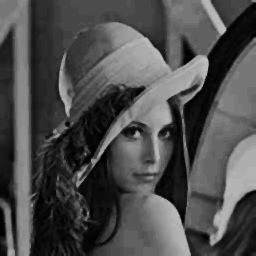
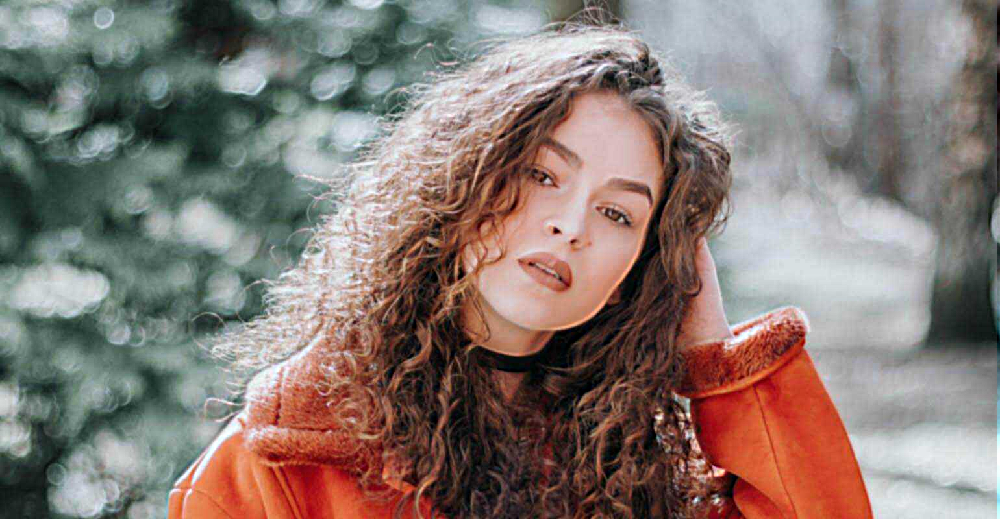

# Denoising-Smoothing-Blurring-Sharpening
non-linear classical approach to denoising, smoothing, blurring and sharpening using median and bilateral filters

*Supports GRAYSCALE and RGB images, and uses clamping*

---

## Denoising

| Original | Median | Bilateral |
|----------|----------------|----------|
|  |  |  |

## Sharpening

| Original | sharpend |
|----------|----------|
|  |  |

---

## Features

- **Median Filter**: Strong noise reduction (especially salt-and-pepper)
- **Bilateral Filter**: Edge-preserving denoising
- **Unsharp Masking**: Sharpening via nonlinear blur subtraction
- **Grayscale and RGB Support**

---

## Parameters to Tune

| Parameter       | Description                                                                 |
|-----------------|-----------------------------------------------------------------------------|
| Kernel Size     | Size of the filtering window (e.g., 3×3, 5×5)                               |
| Sigma Intensity | How much pixel value difference affects bilateral weighting (range filter) |
| Sigma Spatial   | How much spatial distance affects bilateral weighting (domain filter)      |
| Alpha (Sharpen) | Controls sharpening strength (0 to 1)                                       |

---

## How to Use

1. Load your image data  
2. Apply filters, for Example:
   ```cpp
   unsigned char* output = bilateral_filter(img, width, height, channels, kernel_size, sigma_spatial, sigma_intensity);
   unsigned char* sharpened = Sharpen(img, channels, height, width, kernel_size, alpha);

3. Save results and enjoy :)

---

*Developed by Mohammed Yasser Mohammed* 

*email : es-mohamed.yasser2027@alexu.edu.eg* 

